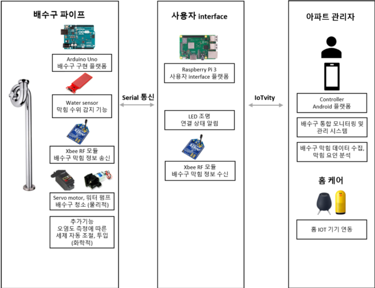

# Drain

: 하수구 및 배수구 자동 처리 기기 (IoT)

---

## 설계도 (Architecture)




## 코드

[Arduino(Actuator)](./Arduino(Actuator))

 : 직접 청소 동작을 실행할 기기에 담긴 SW 코드 (아두이노 기기)

[ocf_server_water_sensor](./ocf_server_water_sensor)

: 사용자와 파이프 구간을 이어주는 사용자 interface 서버, 막힘 상태를 실시간으로 감지하고 이에 대한 청소 동작을 실행 (라즈베리파이, c++)

[ocf_client_raspberrypi](./ocf_client_raspberrypi)

: 서버와 사용자 클라이언트 연결을 확인하는 코드, 막힘이 확인되면 led가 켜지는 동작 실행 (라즈베리파이용, c++)

[ocf_Drain_app](./ocf_Drain_app)

: 아파트 관리자, 집 주인 등등 지정된 사용자가 원격에서도 막힘 상태를 확인 할 수 있도록 client 를 앱으로 작성 (모바일 기기, Android, Java)

---

#### 코드 (detail)

* ocf_Drain_app

  주요 동작 코드가 담긴 파일 : [SimpleClient.java](./ocf_Drain_app/D2DClient/src/main/java/com/ocfk/d2d/simpleserver/SimpleClient.java)

  -> **startSimpleClient(OcConnectivityType type) : 주변에 설정에 맞는 기기들 찾기**

  ->**onResourceFound(OcResource ocResource)**

  : 찾은것 중 tcp통신이 설정된 WaterValueURI 찾기

  : private Map<OcResourceIdentifier, OcResource> mFoundResources = new HashMap<>();

  : mFoundResources.put(ocResource.getUniqueIdentifier(), ocResource);

   -> **getLightResourceRepresentation();** 

  : get API 실행 with OcResource.OnGetListener event

  : server 야 받아랏!

  : Map<String, String> queryParams = new HashMap<>();

  :  mFoundLightResource.get(queryParams, this);

  -> **onGetCompleted(List<OcHeaderOption> list,OcRepresentation ocRepresentation)**

  : get 요청의 응답이 넘어오면, 에러가 없으면 출력!

  : 동시에 waterimage 를 visible 하게 한다.

  : 여기서 출력후에 thread 방식으로 getLightResourceRepresentation(); 이 아이를 계속 3초마다 주기적으로 call!!

  : 그리고 또한, thread로 받은 값을 이용해서 imageviewd의 이미지를 바꾸고, 막힘 상태를 알려준다. 그리고, start버튼을 stop 형식으로 바꿔준다.

  

* ocf_server_water_sensor

  Get 동작 코드가 담긴 파일 : [SensorDetect.cpp](./ocf_server_water_sensor/SensorDetect.cpp)

  : Client로 부터 Server에 get 동작이 호출되었을 때 실행해야할 동작의 내용이 담긴 파일

  : Actuator(아두이노)로 부터 Serial 통신으로 들어온 신호를 파악해서 막힘 상태인지 아닌지를 판단 후에, 그 값을 return 한다.

  Server 통신 관련 주요 코드가 담긴 파일 : [SensorServer.cpp](./ocf_server_water_sensor/SensorServer.cpp)

  : 주요 setting 코드  

  ```c++
  static OCStackResult _set_device_info(void)
  {
    	OCStackResult result = OC_STACK_ERROR;
      string device_type = "oic.d.sensor";
      string device_name = "OCF IoTivity Sensor Server";
      string spec_version = "ocf.1.3.1";
      vector<string> data_model_versions = {"ocf.res.1.3.1"};
      string protocol_independent_id = "b0ed9259-ec95-4ac6-8f62-241d0da02684";
  
  ```

  Server 통신 관련 주요 코드가 담긴 파일 : [SensorResource.cpp](./ocf_server_water_sensor/SensorResource.cpp)

  ```c++
  #define RESOURCE_URI		"/WaterValueURI"
  #define RESOURCE_TYPE_NAME	"oic.r.sensor.water"
  #define RESOURCE_INTERFACE	"oic.if.s"
  #define RESOURCE_PROPERTY	(OC_DISCOVERABLE | OC_OBSERVABLE | OC_SECURE)
  #define RESOURCE_KEY		"value"
  
  SensorResource::SensorResource(void)
  {
  	m_representation.setUri(RESOURCE_URI);
  	m_representation.setValue(RESOURCE_KEY, m_sensorDetect.Detect());
  
  	m_isStartedThread = false;
  }
  
  OCRepresentation SensorResource::Get(void)
  {
  	bool value = m_sensorDetect.Detect();
  	cout << "water sensor value: " << value << endl;	
  	m_representation.setValue(RESOURCE_KEY, value);
  	return m_representation;
  }
  ```

  

